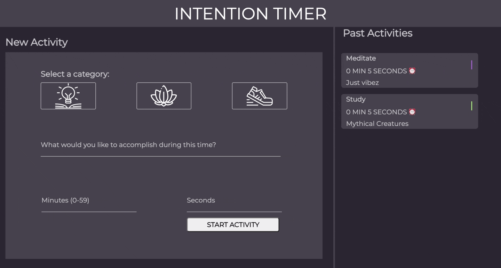
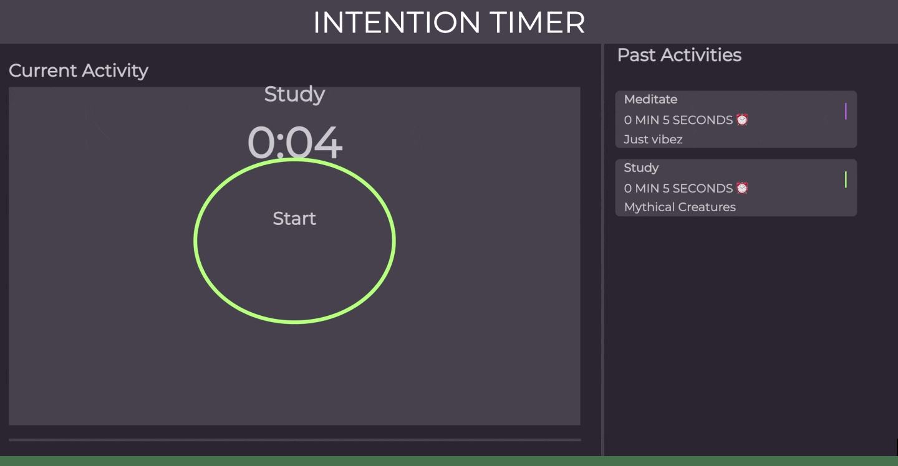

## Overview - Intention-Timer README.md

This application allows users to set goals for themselves tied to three categories of study, meditation, and exercise. Users can select the activity and the amount of time they want to spend doing it and start a timer. Users can then log their activities and save them to local storage.

The site is accessible at [here](https://emorendorff.github.io/intention-timer/). The rubric for the project can be found [here](https://frontend.turing.edu/projects/module-1/intention-timer-group.html).

## Website Preview

## Functionality

* Current: User can fill out a form to create an activity and after such can
  * Start a timer with user input
  * Log completed activities in the past activities section
  * Keep those activities stored upon refresh
  * Hit the new activity button and see the form reset for more intentions!

* Future Goals:
  * Pausing timer
  * Expanding/collapsing past activities
  * Animate the timer
  * Favorite and re-doing recipes

## Iterations

ITERATION 0: Build Out Comp
* Built the layout with HTML & CSS to given comp spec.

ITERATION 1: Activity Class
* Created instances of the class Activity and made methods that allow users to
  * Countdown a timer using user input to a specified time
  * Mark activities as complete when countdown timer finishes
  * Save activities logged in local storage for reference

ITERATION 2: Form Functionality
* When user clicks the category buttons (exercise, meditate, or study), an associated border and icon gives color change indication of selection.
* User fills out input field of "What would you like to accomplish during this time", minutes and seconds.
* User will see an error message display if they try and click "Start Activity" button wherever the user input is not given.
* If user has selected a category and filled out all the given field, the form will disappear and a timer will appear with a corresponding category color.

ITERATION 3: Build an MVP
* User can start the timer by clicking the "Start" button. The timer will count down by the second.

ITERATION 4: Logging Past Activities
* When timer finishes, a completed message will appear and user can click the "Log Activity" button.
* When user clicks the button, a card with the category, time and description of the activity will appear under the "Past Activities" on the right side of the page.

ITERATION 5: Persisting Past Activities
* When the user refreshes the page
  * Their past activities are still displayed!

## Technologies Used

1. HTML
2. CSS
3. JavaScript  
4. GitHub
5. Atom - Teletype package
6. Mac's native terminal

## Contributors

* @emorendorff
* @Meekb
* @shayan-golafshani
